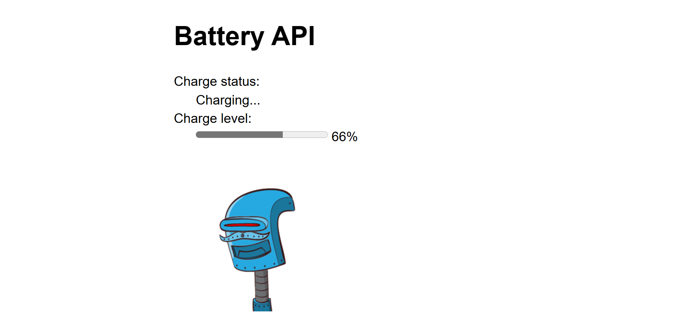

# Battery API 
### DESCRIPTION 
This lab uses the Battery API to retrieve real-time battery information from the user's device. 
It then integrates with the RoboHash third-party API to generate a unique robot image based on the current battery percentage. 
The image is dynamically updated and displayed on the page as the battery level changes.

### LIVE DEMO
You can view the live version of the project here: [Live Demo](https://divine-mbamara.github.io/25W-JavaScript-Lab05-main/)

### PROJECT PREVIEW

### INSTRUCTIONS 
- Use the battery.js file to integrate with 3rd part API (https://robohash.org/)
- Send the battery percentage retrieved using device API to get an image. e.g. https://robohash.org/100.png or https://robohash.org/100percent.png
- Show the image on the html page.
